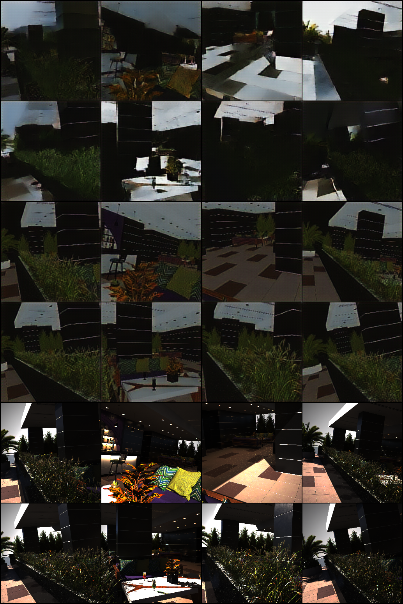
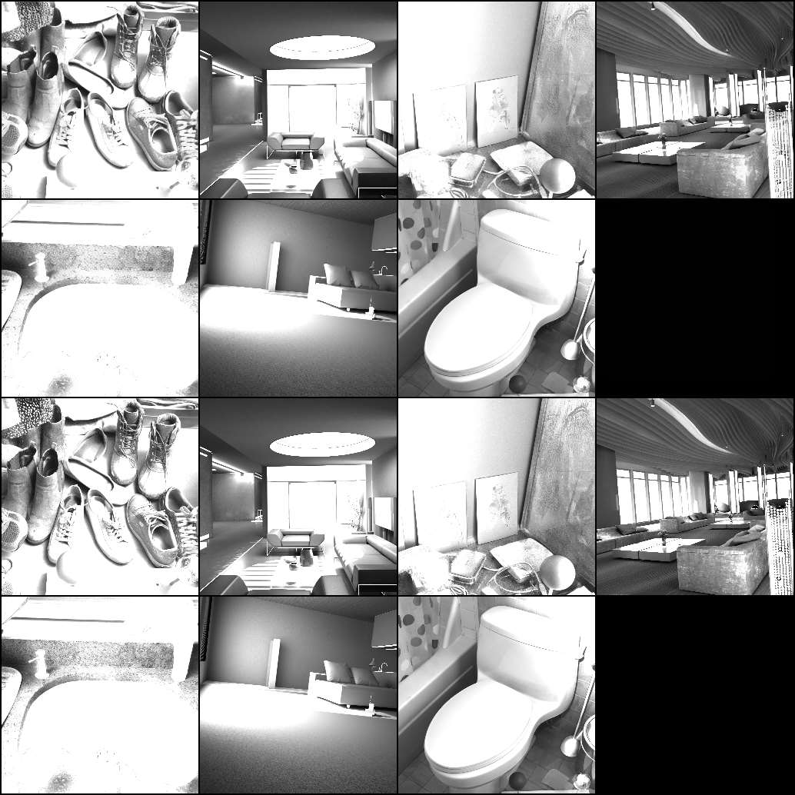
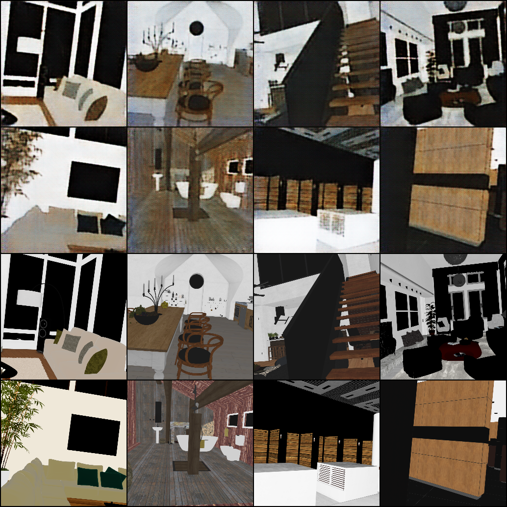

# Image Decomposition into Albedo and Shading via Latent Flow Matching

This repository implements **image intrinsic decomposition** — splitting an input image into **albedo** (reflectance) and **shading** components — using a combination of **Variational Autoencoder** (VAE) and **Latent Flow Matching**.

We train on the **Hypersim dataset** (indoor synthetic scenes) and evaluate on the **ARAP** and **SAW** datasets.  

<p align="center">
  
</p>  

---

## 🔹 What is Flow Matching?

**Flow Matching** is a generative modeling technique that learns to **transform a simple prior distribution (e.g., Gaussian) into a complex data distribution** by solving an Ordinary Differential Equation (ODE).

Instead of iteratively denoising (like diffusion models), flow matching directly learns a **velocity field** that tells us how to move particles in latent space toward realistic samples.  

<p align="center">
  
</p>  

In this project:  
- We first compress albedo images using a **VAE** into latent space.  
- Then, we train a **UNet-based flow matching network** on these latents.  
- We pass our input image to **Encoder** that passes features from last **3** layers to the **Unet** network.
- Then we apply **Euler's** formula on our model output **(velocity)** to get the latent representation.
- We pass our latent representation through the decoder to get the output **Albedo** image.
- Then we divide our **Albedo** image with the input image to get the **Shading** component.

---

## 🔹 Dataset Preprocessing

1. **Download Hypersim dataset**  
   - Extract **albedo** and **HDR** images.  
2. **Tonemap HDR → LDR** (without gamma correction).  
3. **Normalize** to range [0, 1].  
4. **Compute shading ground truth**:  
   
   ```math
   \text{Shading} = \frac{\text{LDR}}{\text{Albedo}}
   ```

5. Final ground truth images:  
   - Albedo  
   - Shading  
   - LDR input image  

---

## 📖 Method Overview

### 🔹 Variational Autoencoder (VAE)
- Trained on **albedo** images resized to **256×256×3**.  
- Latent space: **12 × 32 × 32**.  
- Loss function combines pixel-wise, perceptual, KL divergence, and adversarial terms.  
- VAE is trained for **41 epochs**.

#### Loss Functions

**Reconstruction (L2) loss:**

```math
\mathcal{L}_{\text{L2}} = \|x - \hat{x}\|_2^2
```

**Perceptual (feature) loss** (using a fixed feature extractor $\phi$, e.g., VGG):

```math
\mathcal{L}_{\text{perc}} = \|\phi(x) - \phi(\hat{x})\|_2^2
```

**Kullback–Leibler divergence** (with prior $p(z) = \mathcal{N}(0, I)$ and posterior $q_\phi(z \mid x)$):

```math
\mathcal{L}_{\text{KL}} = D_{\text{KL}}\left(q_\phi(z \mid x)\,\|\,p(z)\right)
```

**Adversarial (generator) loss** (non-saturating GAN form for generator):

```math
\mathcal{L}_{\text{GAN}} = -\,\mathbb{E}_{x}\left[\log D(\hat{x})\right]
```

**Total VAE objective (with your weights):**

```math
\mathcal{L}_{\text{VAE}} =  \cdot \mathcal{L}_{\text{L2}} +  \cdot \mathcal{L}_{\text{perc}} + 0.005 \cdot \mathcal{L}_{\text{KL}} + 0.1 \cdot \mathcal{L}_{\text{GAN}}
```


### Flow Matching Network
- Based on **UNet + encoder features**
- Trained on latent representation of size **12 × 32 × 32**.
- ODE solved using **Euler method** with just **2** timesteps

#### Loss Functions

**Flow Matching loss**:

```math
\mathcal{L}_{\text{FM}} = \mathbb{E}_{t, z_t}\big[\,\|\,v_\theta(z_t, t) - v(z_t, t)\,\|_2^2\big]
```

Additionally, decoded latents are compared with a **perceptual loss** as an auxiliary signal.

**Latent reconstruction (implementation detail):**

```math
\hat{z}_t = x_t + (1 - t)\,\cdot\, v_\theta(x_t, t)
```

(Implemented as `recon_pred_z = path_sample.x_t + (1.0 - t) * model_out`.)

---

## 📂 Repository Structure
```
├── data/                          # Dataset (HyperSim processed)
├── docs/
│   └── flow_matching.png           # Illustration of flow matching
├── evaluation_results/
│   ├── evaluation_result_arap.csv
│   ├── evaluation_results_saw.csv
├── logs/                           # Training logs + loss plots
├── results_during_validation/
│   ├── Model_input_output/
│   ├── Shading/
│   └── albedo/
├── requirements.txt
└── README.md
```

---

## 🚀 Setup
Clone the repo and install dependencies:
```bash
pip install -r requirements.txt
```

---

### 🔹 Flow Matching
Flow matching is a method to learn **continuous-time dynamics** that transport samples from a prior (noise) distribution to the target data distribution.  
Unlike diffusion models, which require stochastic sampling and many steps, flow matching directly trains a neural network to predict the **velocity field** of samples along the flow trajectory.

<p align="center">
  
</p>

- U-Net + encoder used for flow prediction.  
- Latent dynamics integrated using **Euler method (10 steps)**.  
- Training loss: **flow matching objective** + **perceptual loss** after decoding.  
- Trained for **200 epochs**.  

---

## 📊 Results

### Validation Samples
- **Input / Output**  
  <p></p>

- **Shading**  
  <p></p>

- **Albedo**  
  <p></p>

---

### Training Loss Plots
<p align="center">
  
  
</p>
<p align="center">
  
  
</p>

---

### ARAP Dataset Results
<p align="center">
  
</p>

**Evaluation on ARAP Dataset**

| guidance_scale | method | MSE     | RMSE    | LMSE    | SSIM   |
|----------------|--------|---------|---------|---------|--------|
| 1.0            | euler  | 0.0114  | 0.0945  | 0.0289  | 0.8919 |

---

### SAW Dataset Results

| guidance_scale | method | num_batches | MSE    | RMSE   | LMSE | SSIM  |
|----------------|--------|-------------|--------|--------|------|-------|
| 1.0            | euler  | 1166        | 0.0775 | 0.2522 | inf  | 0.593 |

---

## 📌 Notes
- VAE: ~4M parameters  
- Flow model: ~35M parameters  
- Total inference model: ~37M params (**smaller than typical flow/diffusion models**)

---
