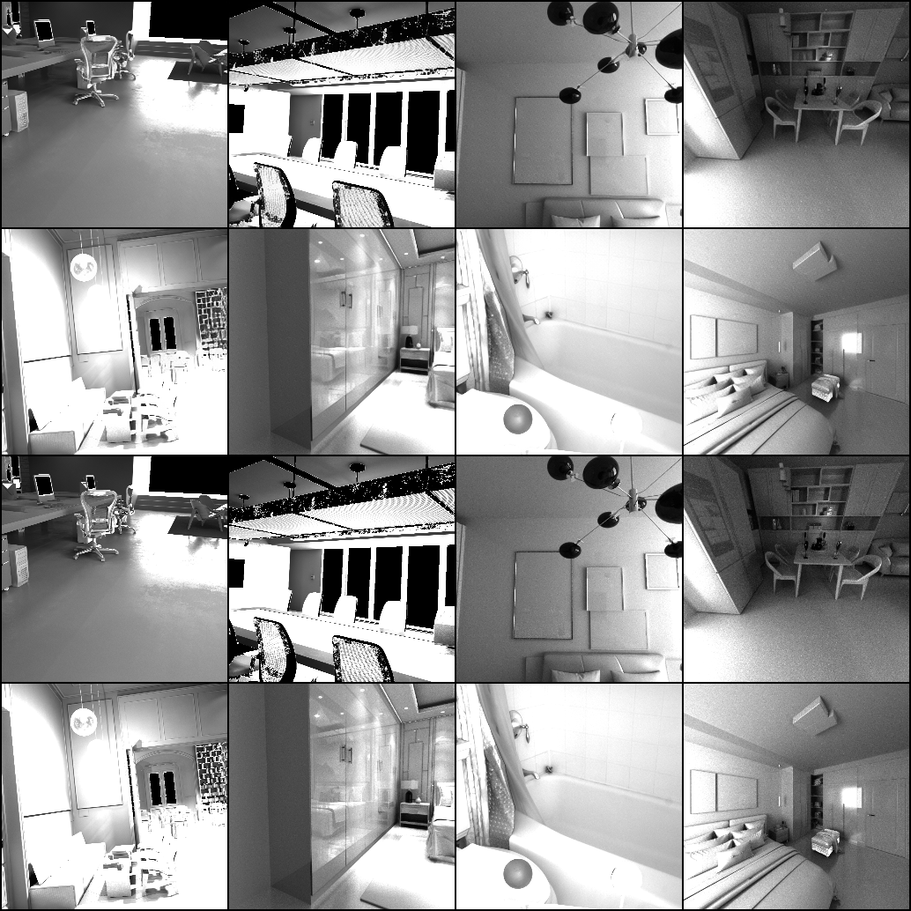

# Image Decomposition into Albedo and Shading via Latent Flow Matching

This repository implements **image intrinsic decomposition** — splitting an input image into **albedo** (reflectance) and **shading** components — using a combination of **Variational Autoencoder** (VAE) and **Latent Flow Matching**.

We train on the **Hypersim dataset** (indoor synthetic scenes) and evaluate on the **ARAP** and **SAW** datasets.  

<p align="center">
  
</p>  

---

## 🔹 What is Flow Matching?

**Flow Matching** is a generative modeling technique that learns to **transform a simple prior distribution (e.g., Gaussian) into a complex data distribution** by solving an Ordinary Differential Equation (ODE).

Instead of iteratively denoising (like diffusion models), flow matching directly learns a **velocity field** that tells us how to move particles in latent space toward realistic samples.  

<p align="center">
  
</p>  

In this project:  
- We first compress albedo images using a **VAE** into latent space.  
- Then, we train a **UNet-based flow matching network** on these latents.  
- We pass our input image to **Encoder** that passes features from last **3** layers to the **Unet** network.
- Then we apply **Euler's** formula on our model output **(velocity)** to get the latent representation.
- We pass our latent representation through the decoder to get the output **Albedo** image.
- Then we divide our **Albedo** image with the input image to get the **Shading** component.

---

## 🔹 Dataset Preprocessing

1. **Download Hypersim dataset**  
   - Extract **albedo** and **HDR** images.  
2. **Tonemap HDR → LDR** (without gamma correction).  
3. **Normalize** to range [0, 1].  
4. **Compute shading ground truth**:  
   
   ```math
   \text{Shading} = \frac{\text{LDR}}{\text{Albedo}}
   ```

5. Final ground truth images:  
   - Albedo  
   - Shading  
   - LDR input image  

---

## 📖 Method Overview

### 🔹 Variational Autoencoder (VAE)
- Trained on **albedo** images resized to **256×256×3**.  
- Latent space: **12 × 32 × 32**.  
- Loss function combines pixel-wise, perceptual, KL divergence, and adversarial terms.  
- VAE is trained for **41 epochs**.

#### Loss Functions

**Reconstruction (L2) loss:**

```math
\mathcal{L}_{\text{L2}} = \|x - \hat{x}\|_2^2
```

**Perceptual (feature) loss** (using a fixed feature extractor $\phi$, e.g., VGG):

```math
\mathcal{L}_{\text{perc}} = \|\phi(x) - \phi(\hat{x})\|_2^2
```

**Kullback–Leibler divergence** (with prior $p(z) = \mathcal{N}(0, I)$ and posterior $`q_\phi(z \mid x)`$):

```math
\mathcal{L}_{\text{KL}} = D_{\text{KL}}\left(q_\phi(z \mid x)\,\|\,p(z)\right)
```

**Adversarial (GAN) loss:**

```math
\mathbb{E}_x [\log (D (x))] + \mathbb{E}_z [\log (1 - D (G (z)))]
```
**Total VAE objective (with your weights):**

```math
\mathcal{L}_{\text{VAE}} =  \cdot \mathcal{L}_{\text{L2}} +  \cdot \mathcal{L}_{\text{perc}} + 0.005 \cdot \mathcal{L}_{\text{KL}} + 0.1 \cdot \mathcal{L}_{\text{GAN}}
```


### Flow Matching Network
- Based on **UNet + encoder features**
- Trained on latent representation of size **12 × 32 × 32**.
- ODE solved using **Euler method** with just **2** timesteps

#### Loss Functions

**Flow Matching loss**:

```math
\mathcal{L}_{\text{FM}} = \mathbb{E}_{t, z_t}\big[\,\|\,v_\theta(z_t, t) - v(z_t, t)\,\|_2^2\big]
```

Additionally, decoded latents are compared with a **perceptual loss** as an auxiliary signal.

**Latent reconstruction (implementation detail):**

```math
\hat{z}_t = x_t + (1 - t)\,\cdot\, v_\theta(x_t, t)
```

(Implemented as `recon_pred_z = path_sample.x_t + (1.0 - t) * model_out`.)


---

## 📊 Results

### Validation Samples

- **Input / Output**  

| Image | Labels |
|-------|--------|
|  | **Model Prediction** <br><br><br><br><br><br> **Ground Truth** <br><br><br><br><br><br> **Input Images** |

- **Shading**
  
| Image | Labels |
|-------|--------|
| |**Model Prediction** <br><br><br><br><br><br> **Ground Truth**|

- **Albedo**

  
| Image | Labels |
|-------|--------|
| |**Model Prediction** <br><br><br><br><br><br> **Ground Truth**|

---

### Training Loss Plots
- **VAE Loss Training**
  <p align="center">
    
    
  </p>
- **VAE Loss Validation**
  <p align="center">
    
  </p>
- **Flow matching Loss Training and Validation**
  <p align="center">
    
  </p>
---
## 🌐 Live Demo

Try our model directly in your browser! The model is deployed on **HuggingFace Spaces** with an interactive Gradio interface.

### 🔗 **[Launch Demo](https://huggingface.co/spaces/Mithleshsingla/IID)**

<div align="center">
  
[](https://huggingface.co/spaces/Mithleshsingla/IID)

</div>

### 📱 Demo Features
- **Fast Inference**: Get results in just 2-20 steps
- **Interactive Controls**: Toggle between Flow Matching and VAE-only modes
- **Real-time Processing**: Upload any image and see instant decomposition
- **Professional UI**: Clean, responsive interface optimized for all devices

### 🖼️ Demo Interface

<div align="center">
  
**Main Interface**
<p align="center">
  
</p>

**Results Showcase**
<p align="center">
  
</p>

</div>

### 🚀 Quick Start with Demo
1. **Visit**: [https://huggingface.co/spaces/Mithleshsingla/IID](https://huggingface.co/spaces/Mithleshsingla/IID)
2. **Upload**: Any image (portraits, objects, scenes work best)
3. **Configure**: Choose Flow Matching mode and adjust steps (10-20 recommended)
4. **Generate**: Click "Generate Decomposition" and see results in seconds!

### ⚙️ Model Deployment
- **Platform**: HuggingFace Spaces
- **Framework**: Gradio
- **Model Size**: ~37M parameters total
- **Inference Speed**: 2-20 timesteps

---
### ARAP Dataset Results
  
| Image | Labels |
|-------|--------|
| |**Ground Truth** <br><br><br><br><br><br> **Model Prediction**|


**Evaluation on ARAP Dataset**

| method | MSE     | RMSE    | LMSE    | SSIM   |
|--------|---------|---------|---------|--------|
| euler  | 0.0114  | 0.0945  | 0.0289  | 0.8919 |

---

### SAW Dataset Results

| method | num_batches | MSE    | RMSE   | SSIM  |
|--------|-------------|--------|--------|-------|
| euler  | 1166        | 0.0775 | 0.2522 | 0.593 |


---

## 📂 Repository Structure
```
├── README.md # Project overview
├── requirements.txt # Python dependencies
├── .gitattributes
│
├── checkpoints/ # Saved model weights
│ ├── discriminator_model.pth
│ ├── unet_encoder_inference.pth
│ └── vae_model.pth
│
├── config/ # YAML configuration files
│
├── data_preprocessing/ # Data preprocessing utilities
│
├── docs/ # Documentation & figures
│ ├── flow_matching.png
│ ├── model_architecture.png
│ └── arap_results/ # Example qualitative results
│
├── eval/ # Evaluation scripts
├── evaluation_results/ # CSV evaluation metrics
├── latent_output/
├── logs/ # Training & validation logs
├── models/ # Model architectures
├── results_during_validation/ # Sample validation results
└── src/ # Training & inference scripts
```

---

## 🚀 Setup
Clone the repo and install dependencies:
```bash
pip install -r requirements.txt
```
---
## 🔹 Usage

### Train VAE
```bash
python src/train_vae.py --config config/autoen_alb.yaml
```
### Train Flow Matching
```bash
python src/train_unet.py --config config/unet_hyperism.yaml
```
### Inference
```bash
python src/inference_unet.py 
```
### Train Evaluation
```bash
python eval/eval_arap.py
```
```bash
python eval/eval_saw.py
```

---
## 📌 Uniqueness
- VAE: ~4M parameters  
- Flow model: ~35M parameters  
- Total inference model: ~37M params (**Much smaller than typical flow/diffusion models**)
- Provides results for just 2 timesteps.

---
